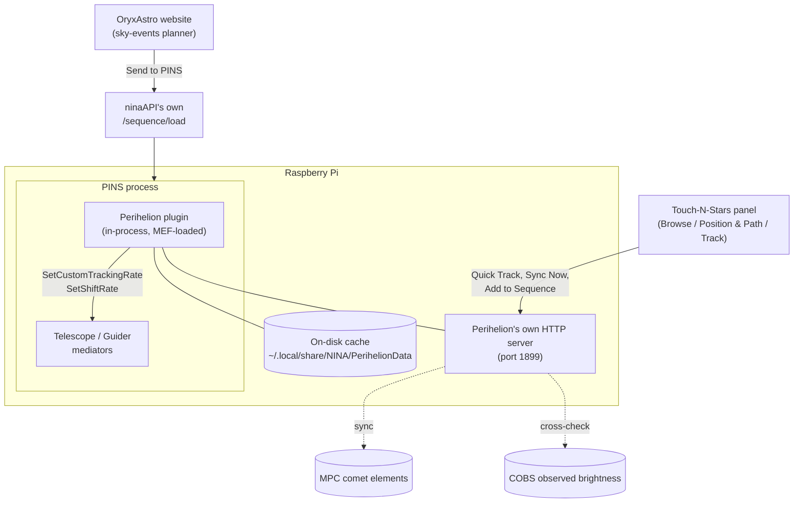

# Perihelion

Non-sidereal tracking for comets and asteroids on [PINS](https://github.com/nitr57/pins) (the Raspberry Pi fork of N.I.N.A.) and its [Touch-N-Stars](https://github.com/Touch-N-Stars/Touch-N-Stars) companion app — with its own Touch-N-Stars panel, an offline-durable data cache, and real observer-reported brightness alongside the predicted value.

## Why this exists

NINA's own [Orbitals plugin](https://github.com/ghilios/NINA.Joko.Plugin.Orbitals) already does non-sidereal tracking, and works well on real Windows NINA. Its database-download screen is a WPF panel, though — and PINS renders no WPF UI shell at all, by design. That specific screen has no path to PINS, and neither `ninaAPI` nor Touch-N-Stars expose an equivalent route to fill the gap.

Perihelion is a standalone plugin built to close that gap for PINS specifically — no shared code, cache format, or namespace with Orbitals. It computes tracking rates in-process (no external service, no internet dependency for the tracking math itself) and ships its own panel in Touch-N-Stars, giving PINS users the equivalent capability on a platform where Orbitals' own screen for it can't run.

## What it does

The orbital mechanics itself isn't reinvented for this plugin — it's a direct C# port of OryxAstro's own comet/asteroid math (the same Kepler and universal-variable solvers, the same finite-difference tracking-rate calculation), built on [`CosineKitty.AstronomyEngine`](https://github.com/cosinekitty/astronomy), the official C# port of the exact `astronomy-engine` npm package the website uses — pinned to the same version on both sides, so the two stay in step rather than drifting into two independently-maintained implementations of the same math.

**Tracking & sequencing**
- Sets a mount's custom RA/Dec tracking rate for a comet or asteroid, computed live from current orbital elements — handles the RA/sidereal-rate unit conversion correctly (NINA's shared telescope layer mirrors ASCOM's own rate convention for every backend, INDI included; a real, easy-to-get-backwards trap — see `SetPerihelionTrackingRate.cs`).
- Coordinates a guider shift rate so PHD2 doesn't fight the deliberate drift, starting guiding itself first if it isn't already running — and unparks the mount itself if needed, rather than silently doing nothing on a parked scope (both real failure modes caught by testing against actual hardware, not just the math in isolation).
- **Add to Sequence** builds a real Advanced Sequencer container (unpark → slew/center → track → guide → imaging loop, with optional meridian-flip and autofocus triggers) and loads it for review — it doesn't auto-start, so nothing runs until you choose to.
- **Quick Track** sets the rate directly, right now, for manual/visual use — independent of the sequencer.
- The exposure filter list is read from the actually-connected filter wheel, not a hardcoded guess — the sequence it builds only ever references filters that really exist on your setup.

**Offline-first by design**
- Comet elements (from the Minor Planet Center) are cached to disk, not just in memory — a PINS restart with no connectivity still has whatever was last synced, rather than failing the first lookup outright.
- An explicit **Sync Now** action, matching Orbitals' own per-object-type download screen, rather than a silent background refresh you have to trust.
- Asteroids are a small, hand-picked, always-available list embedded in the plugin itself — no download needed at all for those.

**Why the lists are short**
- Comets are filtered to those currently brighter than magnitude 16 against the live MPC feed, capped at 30 shown — the number visible on any given day (often around a dozen) reflects how many are actually bright enough to be worth pointing a telescope at right now, not a limitation of the fetch.
- The 13 asteroids are every one bright enough for a typical amateur setup to realistically image. The full JPL/MPC catalog runs to well over a million numbered and provisional asteroids — [NINA's own Orbitals plugin downloads that entire catalog, unfiltered](https://github.com/ghilios/NINA.Joko.Plugin.Orbitals), but the overwhelming majority of it is magnitude 18+ and invisible to any amateur rig. A short, curated list beats an exhaustive but mostly-useless one.

**Real observed brightness**
- Cross-checks the predicted (H/G orbital-model) magnitude against real observer reports from [COBS](https://cobs.si/) — predictions can be off by several magnitudes during an active outburst, which matters for deciding whether a target is actually worth a night's imaging time.

**Framing**
- A framing view centered on the object's real, live position (not a static catalog snapshot), with the camera's actual field of view overlaid — pan to compose the shot, then capture that framing as an offset for the built sequence.
- Shows the object's real 10-night path against the fixed stars directly over the sky imagery, alongside a separate motion-overview chart with a cos(dec)-compensated drift readout and angular scale bar — the framing view answers "will this stay in my shot," the chart answers "how much and which way is it actually moving," since a fast mover's full path can exceed the camera's own field of view.

## How this fits with Touch-N-Stars

**Celestia Atlas** can show a comet and center a mount on it — but that's a single, instantaneous coordinate. There's no non-sidereal tracking behind it: the object starts drifting out of frame the moment imaging begins, uncompensated, with no guider coordination. Perihelion is the layer underneath that keeps it centered for the rest of the session. The two are complementary, not overlapping — Celestia Atlas for browsing and framing at a glance, Perihelion for the tracking, automation, and offline reliability an actual session needs. Perihelion's own framing view goes a step further and embeds a second, independent Celestia Atlas viewer instance directly in its panel, reusing the same real sky imagery rather than building a separate rendering stack.

**The rest of the app, reused rather than duplicated.** The panel doesn't carry its own copy of anything the app already does well: altitude uses the app's existing `raDecToAltAz()` and the connected profile's own location; the camera FOV overlay uses the same field-of-view calculation Celestia Atlas itself uses. It's built as another real Touch-N-Stars plugin — same design tokens, same plugin-registration pattern, its own code-split chunk — not a bolted-on separate app that happens to load in an iframe.

**OryxAstro's own website** can already plan a comet/asteroid session and hand it straight to a PINS rig — the "Send to PINS" button in its Orbital Export modal builds a sequence and posts it to `ninaAPI`'s existing `/sequence/load` route, landing directly in the Advanced Sequencer with Perihelion's own tracking-rate items already wired in. Planning happens wherever's convenient (a desktop browser, days in advance, with COBS data and framing tools this panel doesn't need to duplicate); execution happens on the rig at the dark site, sequenced and ready.

## Architecture

## Status

Working prototype, tested against real hardware (INDI mount + PHD2 guiding). Not yet packaged as a `.deb` for PINS' own plugin distribution — see the plugin's own build notes for the current dev setup.

## License

Perihelion, a comet/asteroid tracking plugin for PINS
Copyright (C) 2026 OryxAstro

This program is free software: you can redistribute it and/or modify it under the terms of the GNU General Public License as published by the Free Software Foundation, either version 3 of the License, or (at your option) any later version. See [LICENSE](LICENSE) for the full text.

This program is distributed in the hope that it will be useful, but WITHOUT ANY WARRANTY; without even the implied warranty of MERCHANTABILITY or FITNESS FOR A PARTICULAR PURPOSE.
