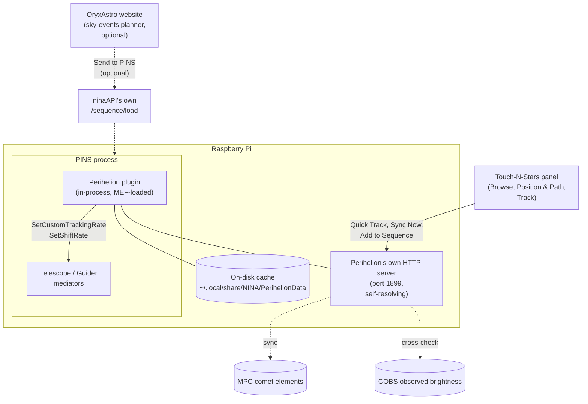

# Perihelion

Non-sidereal tracking for comets and asteroids on [PINS](https://github.com/nitr57/pins) (the Raspberry Pi fork of N.I.N.A.) and its [Touch-N-Stars](https://github.com/Touch-N-Stars/Touch-N-Stars) companion app — with its own Touch-N-Stars panel, an offline-durable data cache, and real observer-reported brightness alongside the predicted value.

## Why this exists

NINA's own [Orbitals plugin](https://github.com/ghilios/NINA.Joko.Plugin.Orbitals) already does non-sidereal tracking, and works well on real Windows NINA. Its database-download screen is a WPF panel, though — and PINS renders no WPF UI shell at all, by design. That specific screen has no path to PINS, and neither `ninaAPI` nor Touch-N-Stars expose an equivalent route to fill the gap.

Perihelion is a standalone plugin built to close that gap for PINS specifically — no shared code, cache format, or namespace with Orbitals. It computes tracking rates in-process (no external service, no internet dependency for the tracking math itself) and ships its own panel in Touch-N-Stars, giving PINS users the equivalent capability on a platform where Orbitals' own screen for it can't run.

## What it does

The orbital mechanics itself isn't reinvented for this plugin — it's a direct C# port of OryxAstro's own comet/asteroid math (the same Kepler and universal-variable solvers, the same finite-difference tracking-rate calculation), built on [`CosineKitty.AstronomyEngine`](https://github.com/cosinekitty/astronomy), the official C# port of the exact `astronomy-engine` npm package the website uses — pinned to the same version on both sides, so the two stay in step rather than drifting into two independently-maintained implementations of the same math.

**Tracking & sequencing**
- Sets a mount's custom RA/Dec tracking rate for a comet or asteroid, computed live from current orbital elements and corrected for light-time, stellar aberration, and the observer's own site (topocentric parallax, not just Earth's center) — not a naive instantaneous-position snapshot. Also handles the RA/sidereal-rate unit conversion correctly (NINA's shared telescope layer mirrors ASCOM's own rate convention for every backend, INDI included; a real, easy-to-get-backwards trap — see `SetPerihelionTrackingRate.cs`).
- Coordinates a guider shift rate so PHD2 doesn't fight the deliberate drift, starting guiding itself first if it isn't already running — and unparks the mount itself if needed, rather than silently doing nothing on a parked scope (both real failure modes caught by testing against actual hardware, not just the math in isolation).
- **Add to Sequence** builds a real Advanced Sequencer container (unpark → slew/center → track → guide → imaging loop, with optional meridian-flip and autofocus triggers) and loads it for review — it doesn't auto-start, so nothing runs until you choose to. The tracking-rate item keeps the target's coordinates live for as long as the sequence stays loaded, recomputing every 30 seconds rather than freezing at whatever position was current when the sequence was built — a target queued behind other steps for a while won't have gone stale by the time its own turn comes up. A **Download sequence** button next to it saves the identical JSON as a file instead of loading it live — for reviewing or importing later, or for someone who doesn't want it in PINS' sequencer right away.
- **Quick Track** sets the rate directly, right now, for manual/visual use — independent of the sequencer. Optionally keeps re-applying it every 15 minutes on its own, entirely in the plugin, so a long unattended session stays accurate as the object's true rate drifts through the night, rather than holding the one rate computed when you pressed the button. A live status readout shows the real RA/Dec rate actually sent (not just that a toggle was on), when it was last applied, and a countdown to the next re-apply — polled from the plugin itself, so it stays accurate even if you're not the one who started the session. Quick Track deliberately never slews the mount on its own — it's built for "I've already centered it, just keep it tracking." A **Slew & Center** button sits right next to it for when you haven't: it points the mount at the object's live position and plate-solves to confirm, reusing `ninaAPI`'s own existing slew route rather than anything new — and unparks the mount first if needed, a real gap caught on an OnStep mount that otherwise just did nothing when parked, with no error shown.
- **Meridian safety cutoff**: Quick Track has no sequence of its own and so no `MeridianFlipTrigger` either — on a German Equatorial Mount, nothing was stopping it from tracking straight past the meridian until the OTA or counterweight swung into the tripod or pier. It now polls NINA's own live `TimeToMeridianFlip` (already factoring in the profile's own configured safety margin) roughly once a minute and stops itself — sidereal tracking, guider shift off — the moment that limit is reached, with a real, unmissable reason shown in the Track tab. It stops rather than performing the flip itself: NINA's own raw flip command is just the pier-flip device call, not the full stop-guiding/plate-solve/recenter/resume-guiding sequence `MeridianFlipTrigger` orchestrates inside a real sequence — reimplementing that safely outside the one place it's actually tested wasn't worth it for a feature scoped to manual/visual use in the first place. Add to Sequence's own optional meridian-flip trigger is unaffected and already handles a real flip correctly when enabled.
- The exposure filter list is read from the actually-connected filter wheel, not a hardcoded guess — the sequence it builds only ever references filters that really exist on your setup.

**Getting centered first** — before Quick Track, the mount needs to actually be pointed at the object. Two equally valid ways: use Celestia Atlas's own search-and-slew (it has its own live comet catalog, independent of Perihelion), or use Perihelion's own **Slew & Center** button in the Track tab, which points at Perihelion's own live-computed position instead. Either way, once you're centered, Quick Track or Add to Sequence takes it from there.

**Offline-first by design**
- Comet elements (from the Minor Planet Center) are cached to disk, not just in memory — a PINS restart with no connectivity still has whatever was last synced, rather than failing the first lookup outright.
- Real observed brightness from COBS (see below) is disk-cached too, per comet — a real hardware problem this fixed: a cold in-memory-only cache made every PINS restart's first Browse-tab load re-fetch all ~30 comets from COBS live before the list could even render, measured at 14–18 seconds. Now that cost is paid once per comet as its own 2-hour cache entry lapses, not on every restart.
- The Browse list itself never waits on COBS at all — it returns predicted magnitude instantly, then fills in real observed-brightness badges one comet at a time in the background as each one's own request resolves, so a cold cache no longer stalls the whole list either.
- An explicit **Sync Now** action, matching Orbitals' own per-object-type download screen, rather than a silent background refresh you have to trust — and a separate **Refresh COBS** action alongside it, since a full COBS sweep across every listed comet costs the same real network round-trip the disk cache exists to keep off the normal load path, so it stays a deliberate, separate action rather than riding along with Sync Now.
- Asteroids are a small, hand-picked, always-available list embedded in the plugin itself — no download needed at all for those.

**Why the lists are short**
- Comets are filtered to those currently brighter than magnitude 16 against the live MPC feed, capped at 30 shown — the number visible on any given day (often around a dozen) reflects how many are actually bright enough to be worth pointing a telescope at right now, not a limitation of the fetch.
- The 13 asteroids are every one bright enough for a typical amateur setup to realistically image. The full JPL/MPC catalog runs to well over a million numbered and provisional asteroids — [NINA's own Orbitals plugin downloads that entire catalog, unfiltered](https://github.com/ghilios/NINA.Joko.Plugin.Orbitals), but the overwhelming majority of it is magnitude 18+ and invisible to any amateur rig. A short, curated list beats an exhaustive but mostly-useless one.

**Real observed brightness**
- Cross-checks the predicted (H/G orbital-model) magnitude against real observer reports from [COBS](https://cobs.si/) — predictions can be off by several magnitudes during an active outburst, which matters for deciding whether a target is actually worth a night's imaging time.
- The Position & Path tab also surfaces Alt/Az, Sun distance, Earth distance, solar elongation, the IAU constellation the object currently sits in, and (comets only) the date of perihelion passage straight from the MPC feed's own orbital elements — tucked behind a collapsed "More Details" disclosure so they're there when wanted without permanently crowding an already-detailed tab.

**Framing**
- A framing view centered on the object's real, live position (not a static catalog snapshot), with the camera's actual field of view overlaid — pan to compose the shot, then capture that framing as an offset for the built sequence.
- Shows the object's real 10-night path against the fixed stars directly over the sky imagery, alongside a separate motion-overview chart with a cos(dec)-compensated drift readout and angular scale bar — the framing view answers "will this stay in my shot," the chart answers "how much and which way is it actually moving," since a fast mover's full path can exceed the camera's own field of view.

## How this fits with Touch-N-Stars

**Celestia Atlas** can show a comet and center a mount on it — but that's a single, instantaneous coordinate. There's no non-sidereal tracking behind it: the object starts drifting out of frame the moment imaging begins, uncompensated, with no guider coordination. Perihelion is the layer underneath that keeps it centered for the rest of the session. The two are complementary, not overlapping — Celestia Atlas for browsing and framing at a glance, Perihelion for the tracking, automation, and offline reliability an actual session needs. Perihelion's own framing view goes a step further and embeds a second, independent Celestia Atlas viewer instance directly in its panel, reusing the same real sky imagery rather than building a separate rendering stack.

**The rest of the app, reused rather than duplicated.** The panel doesn't carry its own copy of anything the app already does well: altitude uses the app's existing `raDecToAltAz()` and the connected profile's own location; the camera FOV overlay uses the same field-of-view calculation Celestia Atlas itself uses. It's built as another real Touch-N-Stars plugin — same design tokens, same plugin-registration pattern, its own code-split chunk, every user-facing string in the app's own locale files rather than hardcoded English — not a bolted-on separate app that happens to load in an iframe.

**Entirely optional: OryxAstro's own website.** Perihelion is a complete, standalone PINS plugin on its own — the Touch-N-Stars panel above is the whole thing, nothing else is required to browse, track, or build a sequence. If you also happen to use OryxAstro's website for planning, it can additionally hand a session straight to a PINS rig — the "Send to PINS" button in its Orbital Export modal builds a sequence and posts it to `ninaAPI`'s existing `/sequence/load` route, landing directly in the Advanced Sequencer with Perihelion's own tracking-rate items already wired in. Planning happens wherever's convenient (a desktop browser, days in advance, with COBS data and framing tools this panel doesn't need to duplicate); execution happens on the rig at the dark site, sequenced and ready. But this is a bonus integration, not a dependency — nothing about Perihelion needs the website to exist.

## Architecture

## Status

Working prototype, tested against real hardware (INDI mount + PHD2 guiding), and separately verified end-to-end against an INDI Telescope Simulator: the auto-reapply timer logged three real ticks exactly 15 minutes apart, each with a freshly recomputed (not cached) RA/Dec rate. Light-time, aberration, and topocentric parallax correction, and the live coordinate-refresh loop for Add to Sequence, build clean but haven't yet been checked against real hardware or a loaded sequence. **The meridian safety cutoff has not yet been verified against a real mount actually crossing the meridian** — it builds clean and the underlying `TimeToMeridianFlip` reasoning is verified directly against NINA's own source, but treat it as unproven until watched fire for real; don't rely on it alone anywhere near a mount's own mechanical limits until then. Not yet packaged as a `.deb` for PINS' own plugin distribution — see the plugin's own build notes for the current dev setup.

## License

Perihelion, a comet/asteroid tracking plugin for PINS
Copyright (C) 2026 OryxAstro

This program is free software: you can redistribute it and/or modify it under the terms of the GNU General Public License as published by the Free Software Foundation, either version 3 of the License, or (at your option) any later version. See [LICENSE](LICENSE) for the full text.

This program is distributed in the hope that it will be useful, but WITHOUT ANY WARRANTY; without even the implied warranty of MERCHANTABILITY or FITNESS FOR A PARTICULAR PURPOSE.
