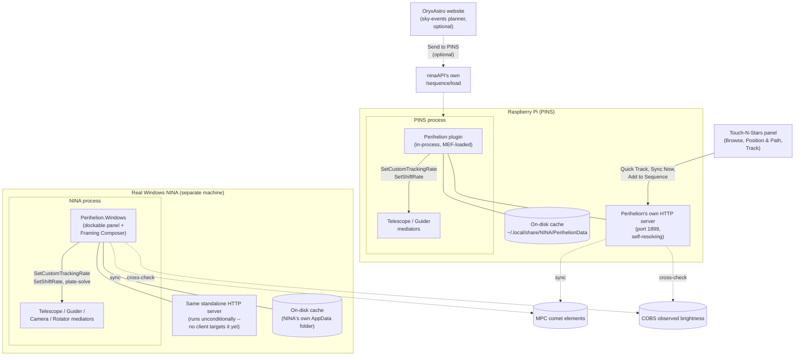

# Perihelion

Non-sidereal tracking for comets and asteroids across three front ends: [PINS](https://github.com/nitr57/pins) (the Raspberry Pi fork of N.I.N.A.) with its [Touch-N-Stars](https://github.com/Touch-N-Stars/Touch-N-Stars) companion app, and a separate **native build for Windows N.I.N.A.** — a dockable panel plus a standalone Framing Composer window, for users who never touch PINS at all. One shared orbital-mechanics/tracking core; two independent UI layers on top of it.

## Why this exists

NINA's own [Orbitals plugin](https://github.com/ghilios/NINA.Joko.Plugin.Orbitals) already does non-sidereal tracking, and works well on Windows NINA. Its database-download screen is a WPF panel, though — and PINS renders no WPF UI shell at all, by design. That specific screen has no path to PINS, and neither `ninaAPI` nor Touch-N-Stars expose an equivalent route to fill the gap.

Perihelion closes that gap for PINS with no shared code, cache format, or namespace with Orbitals — computing tracking rates in-process (no external service, no internet dependency for the tracking math itself) and shipping its own Touch-N-Stars panel. The same core also ships as a native Windows plugin for Windows NINA users, independent of PINS entirely — see [Native Windows NINA plugin](#native-windows-nina-plugin) below.

## What it does

The orbital mechanics itself isn't reinvented for this plugin — it's a direct C# port of OryxAstro's own comet/asteroid math (the same Kepler and universal-variable solvers, the same finite-difference tracking-rate calculation), built on [`CosineKitty.AstronomyEngine`](https://github.com/cosinekitty/astronomy), the official C# port of the exact `astronomy-engine` npm package the website uses — pinned to the same version on both sides, so the two stay in step rather than drifting into two independently-maintained implementations of the same math.

### Tracking & sequencing

- **Custom tracking rate**, computed live from current orbital elements and corrected for light-time, stellar aberration, and the observer's own site (topocentric parallax, not just Earth's center) — not a naive instantaneous-position snapshot. Also handles the RA/sidereal-rate unit conversion correctly (NINA's shared telescope layer mirrors ASCOM's own rate convention for every backend, INDI included — an easy-to-get-backwards trap; see `SetPerihelionTrackingRate.cs`).
- **Guider coordination** — sets a shift rate so PHD2 doesn't fight the deliberate drift, starting guiding itself first if it isn't already running. Unparks the mount itself if needed rather than silently doing nothing on a parked scope (both failure modes caught against real hardware, not just the math in isolation).
- **Add to Sequence** builds an Advanced Sequencer container (unpark → slew/center → track → guide → imaging loop, with optional meridian-flip and autofocus triggers) and loads it for review — it doesn't auto-start. The tracking-rate item keeps the target's coordinates live for as long as the sequence stays loaded, recomputing every 30 seconds rather than freezing at whatever position was current when the sequence was built. A **Download sequence** button saves the identical JSON as a file instead, for reviewing or importing later.
- **Quick Track** sets the rate directly, right now, for manual/visual use — independent of the sequencer, and it never slews the mount on its own (that's what **Slew & Center** next to it is for). Optionally re-applies itself every 15 minutes so a long unattended session stays accurate as the object's true rate drifts through the night, rather than holding whatever rate was computed when the button was pressed. A live status readout shows the RA/Dec rate actually sent, when it was last applied, and a countdown to the next re-apply.
- **Meridian safety cutoff** — Quick Track has no sequence of its own and so no `MeridianFlipTrigger` either, so on a German Equatorial Mount nothing would otherwise stop it tracking straight past the meridian until hardware collides with the pier. It polls NINA's own live `TimeToMeridianFlip` (already honoring the profile's configured safety margin) roughly once a minute and stops itself — sidereal tracking, guider shift off — the moment that limit is reached, with a clear reason shown in the Track tab. It stops rather than performing the flip itself, since NINA's raw flip command is just the pier-flip device call, not the full stop-guiding/plate-solve/recenter/resume-guiding sequence `MeridianFlipTrigger` orchestrates — reimplementing that safely outside the one place it's actually tested wasn't worth it for a feature scoped to manual/visual use. Add to Sequence's own optional meridian-flip trigger is unaffected.
- The exposure filter list is read from the actually-connected filter wheel, not a hardcoded guess.

**Getting centered first** — before Quick Track, the mount needs to actually be pointed at the object. Two equally valid ways: Celestia Atlas's own search-and-slew (it has its own live comet catalog, independent of Perihelion), or Perihelion's own **Slew & Center** button, which points at Perihelion's own live-computed position instead. Either way, once centered, Quick Track or Add to Sequence takes it from there.

### Offline-first by design

- Comet elements (from the Minor Planet Center) are cached to disk, not just in memory — a restart with no connectivity still has whatever was last synced.
- Real observed brightness from COBS (see below) is disk-cached too, per comet. A real hardware problem this fixed: a cold in-memory-only cache made every restart's first Browse-tab load re-fetch all ~30 comets from COBS live before the list could render, measured at 14–18 seconds. Now that cost is paid once per comet as its own 2-hour cache entry lapses, not on every restart.
- The Browse list never waits on COBS at all — it returns predicted magnitude instantly, then fills in real observed-brightness badges one comet at a time in the background.
- An explicit **Sync Now** action, matching Orbitals' own per-object-type download screen, plus a separate **Refresh COBS** action alongside it (a full COBS sweep costs the same real network round-trip the disk cache exists to keep off the normal load path, so it stays deliberate rather than riding along with Sync Now).
- Asteroids are a small, hand-picked, always-available list embedded in the plugin itself — no download needed.

**Why the lists are short**: comets are filtered to those currently brighter than magnitude 16 against the live MPC feed, capped at 30 shown — the number visible on any given day (often around a dozen) reflects how many are actually worth pointing a telescope at, not a limitation of the fetch. The 13 asteroids are every one bright enough for a typical amateur setup to realistically image; [NINA's own Orbitals plugin downloads the entire JPL/MPC catalog](https://github.com/ghilios/NINA.Joko.Plugin.Orbitals) (well over a million objects, the overwhelming majority magnitude 18+ and invisible to any amateur rig) — a short, curated list beats an exhaustive but mostly-useless one.

### Real observed brightness

- Cross-checks the predicted (H/G orbital-model) magnitude against real observer reports from [COBS](https://cobs.si/) — predictions can be off by several magnitudes during an active outburst, which matters for deciding whether a target is worth a night's imaging time.
- The Position & Path tab surfaces Alt/Az, Sun distance, Earth distance, solar elongation, the IAU constellation the object currently sits in, and (comets only) the date of perihelion passage — tucked behind a collapsed "More Details" disclosure so they're there when wanted without crowding an already-detailed tab.

### Framing

- A framing view centered on the object's real, live position (not a static catalog snapshot), with the camera's actual field of view overlaid — pan to compose the shot, then capture that framing as an offset for the built sequence.
- The object's real 10-night path renders directly over the sky imagery in the framing view itself, alongside a separate motion-overview chart with a cos(dec)-compensated drift readout and a real angular scale bar — the framing view answers "will this stay in my shot," the chart answers "how much and which way is it actually moving," since a fast mover's full path can exceed the camera's own field of view.

## Native Windows NINA plugin

A genuinely separate front end (`Perihelion.Windows`) for users on real Windows NINA who have no PINS box and no Touch-N-Stars — sharing the exact same tracking core (`Perihelion/Api`, `Astrometry`, `SequenceItems`, `Utility`, compiled directly into a second assembly, not forked), with its own native WPF UI instead of a web panel.

**A real dockable panel**, in NINA's own Imaging tab: Browse and load a comet or asteroid, see its live position, rate, orbital elements, tonight's altitude, and 10-night path, then either **Add to Sequence** or **Quick Track** it right now — the same two mechanisms described above, driven natively instead of over HTTP.

**The Perihelion Framing Composer** — a standalone popup window (not a redirect to NINA's own Framing Assistant tab) opened from the panel's **Frame** button:

- A real sky-survey image centered on the target, with the camera's real FOV rectangle overlaid, scaled and sized from the connected profile's own gear settings. Six sources: five live photographic ones (NASA/HIPS2FITS/STSCI/ESO/SkyServer), plus NINA's own **Offline Sky Map** — real NINA's own `SkyMapAnnotator`, not a custom rendering, compositing catalog stars/constellations/grid with whatever photographic tiles already exist in the user's own Sky Survey Cache folder for that field — and a **Cache** source that searches that same on-disk folder directly, so both work fully offline once a target's imagery has been fetched once.
- Scroll to zoom, drag to pan and reframe — the target marker and its name label track the real sky as you pan; the FOV box stays fixed at the viewport's own center.
- The object's own 10-night path renders directly on the sky map, matching the Touch-N-Stars framing view's own look — the target's name sits on whichever side keeps it clear of the path line.
- **Slew and Center** (with a settings cog for Slew / Slew & Center / Slew, Center & Rotate), **Determine Rotation from Camera** (a real plate-solve reading of the camera's current rotation, usable with or without a rotator connected), and **Capture Offset from Mount** for framing off-center on a comet's tail rather than its nucleus.
- **Use This Framing** hands the captured offset and rotation straight to Add to Sequence and Quick Track back on the main panel — it doesn't slew or start anything by itself. **Reset** clears the session's own adjustments without closing the window.

## How this fits with Touch-N-Stars

**Celestia Atlas** can show a comet and center a mount on it — but that's a single, instantaneous coordinate. There's no non-sidereal tracking behind it: the object starts drifting out of frame the moment imaging begins, uncompensated, with no guider coordination. Perihelion is the layer underneath that keeps it centered for the rest of the session. The two are complementary, not overlapping — Celestia Atlas for browsing and framing at a glance, Perihelion for the tracking, automation, and offline reliability an actual session needs. Perihelion's own framing view embeds a second, independent Celestia Atlas viewer instance directly in its panel, reusing the same real sky imagery rather than building a separate rendering stack.

**The rest of the app, reused rather than duplicated.** The panel doesn't carry its own copy of anything the app already does well: altitude uses the app's existing `raDecToAltAz()` and the connected profile's own location; the camera FOV overlay uses the same field-of-view calculation Celestia Atlas itself uses. It's built as another real Touch-N-Stars plugin — same design tokens, same plugin-registration pattern, its own code-split chunk, every user-facing string in the app's own locale files — not a bolted-on separate app that happens to load in an iframe.

**Entirely optional: OryxAstro's own website.** Perihelion is a complete, standalone plugin on its own — nothing else is required to browse, track, or build a sequence. If you also use OryxAstro's website for planning, it can additionally hand a session straight to a PINS rig — the "Send to PINS" button in its Orbital Export modal builds a sequence and posts it to `ninaAPI`'s existing `/sequence/load` route, landing directly in the Advanced Sequencer with Perihelion's own tracking-rate items already wired in. Planning happens wherever's convenient (a desktop browser, days in advance, with COBS data and framing tools this panel doesn't need to duplicate); execution happens on the rig at the dark site. But this is a bonus integration, not a dependency.

## Architecture

## Status

**PINS / Touch-N-Stars**: working prototype, tested against real hardware (INDI mount + PHD2 guiding), and separately verified end-to-end against an INDI Telescope Simulator — the auto-reapply timer logged three real ticks exactly 15 minutes apart, each with a freshly recomputed (not cached) RA/Dec rate. Light-time, aberration, and topocentric parallax correction, and the live coordinate-refresh loop for Add to Sequence, build clean but haven't yet been checked against real hardware or a loaded sequence. **The meridian safety cutoff has not yet been verified against a real mount actually crossing the meridian** — the underlying `TimeToMeridianFlip` reasoning is verified directly against NINA's own source, but treat it as unproven until watched fire for real. Not yet packaged as a `.deb` for PINS' own plugin distribution.

**Native Windows NINA plugin**: [first public release (1.0.0.0)](https://github.com/OryxAstro/perihelion/releases/tag/v1.0.0.0) is out, built and exercised on a real Windows NINA test machine for every UI/layout fix, including the dockable panel's own live Quick Track status (elapsed time, last-applied timestamp, next-reapply countdown, and separate tracking/guiding error lines, matching the Touch-N-Stars panel). Not yet listed in NINA's own in-app Plugin Manager — manual install (extract the release archive into `%LocalAppData%\NINA\Plugins\3.0.0\Perihelion\`) only, for now; submitting the official plugin manifest is in progress. Still unverified against real hardware: the FOV/rotation rectangle's own rotation direction against a physical rotator, the "Determine Rotation from Camera" plate-solve path end to end, and Add to Sequence's built container actually loading correctly into a real Advanced Sequencer.

## License

Perihelion, a comet/asteroid tracking plugin for PINS and Windows NINA
Copyright (C) 2026 OryxAstro

This program is free software: you can redistribute it and/or modify it under the terms of the GNU General Public License as published by the Free Software Foundation, either version 3 of the License, or (at your option) any later version. See [LICENSE](LICENSE) for the full text.

This program is distributed in the hope that it will be useful, but WITHOUT ANY WARRANTY; without even the implied warranty of MERCHANTABILITY or FITNESS FOR A PARTICULAR PURPOSE.
