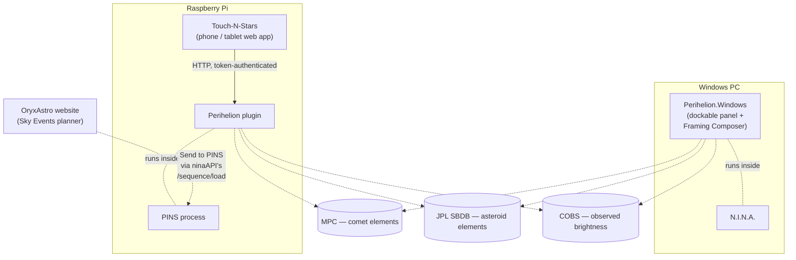
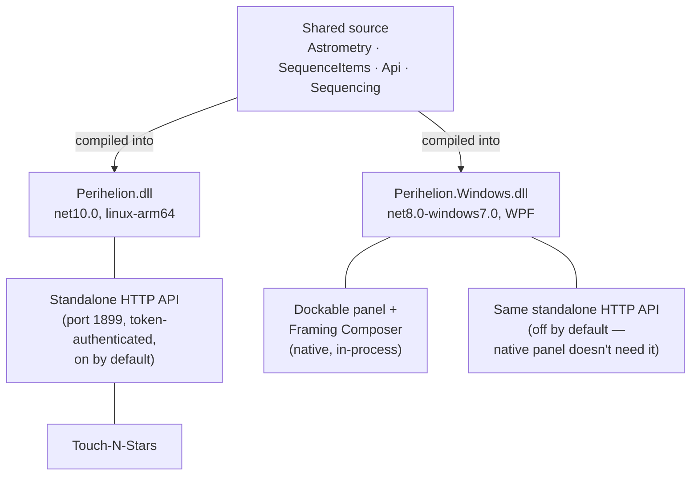
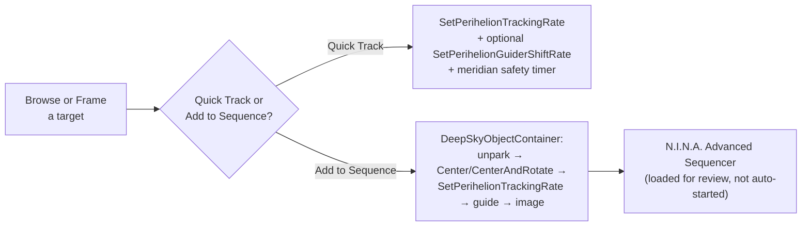

# Perihelion

Non-sidereal tracking for comets and asteroids in N.I.N.A. Computes a live custom RA/Dec
tracking rate from current orbital elements and drives the mount/guider directly — no
Orbitals-plugin dependency, no shared cache format, no external service.

Two front ends share one core:

- **Touch-N-Stars panel**, for [PINS](https://github.com/nitr57/pins) (the Raspberry Pi fork of
  N.I.N.A., which renders no UI shell of its own) — talks to Perihelion over its own standalone
  HTTP API.
- **Perihelion.Windows**, a native plugin for Windows N.I.N.A. — a dockable panel plus a popup
  Framing Composer window, running in-process, no HTTP involved.

## Why this exists

N.I.N.A.'s own [Orbitals plugin](https://github.com/ghilios/NINA.Joko.Plugin.Orbitals) already
does non-sidereal tracking on Windows, but its database-download screen is a WPF panel — and
PINS renders no WPF UI shell at all. That screen has no path to PINS, and neither `ninaAPI` nor
Touch-N-Stars expose an equivalent route. Perihelion closes that gap with an independent
implementation: its own namespace, its own cache format, tracking rates computed in-process.

## Ecosystem

Each rig is independent — a PINS box with Touch-N-Stars needs no Windows machine, and a Windows
N.I.N.A. install needs no PINS box. The OryxAstro website integration is optional in both cases.

## What it does

### Tracking

- Custom RA/Dec tracking rate computed live from current orbital elements, corrected for
  light-time, stellar aberration, and topocentric parallax (the observer's actual site, not
  Earth's center).
- Correct RA/sidereal-rate unit handling for every backend N.I.N.A. supports (ASCOM, INDI).
- Optional EQMOD RA rate correction — EQMOD's ASCOM and INDI drivers both read the RA rate in
  raw arcsec/sec rather than N.I.N.A.'s own seconds-of-RA-per-sidereal-second convention.
- Guider coordination: sets PHD2's shift rate so guiding doesn't fight the deliberate drift,
  starting guiding itself if it isn't already running. Unparks the mount if needed.

### Sequencing

- **Add to Sequence** builds an Advanced Sequencer container (unpark → slew/center/rotate →
  track → guide → filter/exposure loop, with optional meridian-flip and autofocus triggers) and
  loads it for review — it doesn't auto-start. The target's coordinates and framing stay live,
  recomputed every 30 seconds for as long as the sequence remains loaded.
- **Quick Track** sets the rate directly, independent of any sequence, for manual/visual use or
  a target already centered. Optionally re-applies itself on a timer (default 15 minutes) as the
  object's true rate drifts through the night.
- **Meridian safety cutoff**: Quick Track has no sequence and no `MeridianFlipTrigger`, so
  nothing else would stop it tracking a GEM straight past the meridian. Checked once a minute
  against the mount's own hour angle, honoring the same `MaxMinutesAfterMeridian`/
  `PauseTimeBeforeMeridian` margins configured in N.I.N.A.'s own Meridian Flip settings. Actually
  stops tracking and guiding, not just switches to sidereal — it stops rather than performing the
  flip itself, since that's a full stop-guiding/plate-solve/recenter/resume-guiding sequence only
  `MeridianFlipTrigger` orchestrates, inside a sequence. Add to Sequence's own optional
  meridian-flip trigger is unaffected.

### Framing

- A framing view centered on the object's live position, with the camera's actual field of view
  overlaid — pan to compose the shot (e.g. off-center on a comet's tail), then capture that
  offset for the built sequence.
- The object's 10-night path renders directly over the sky imagery, alongside a separate
  motion-overview chart with a cos(dec)-compensated drift readout and an angular scale bar.
- Windows only: the **Framing Composer**, a standalone window with a sky-survey image (five
  live photographic sources plus N.I.N.A.'s own Offline Sky Map and on-disk cache, so it works
  offline once imagery is fetched), Slew/Center/Rotate, and "Determine Rotation from Camera" (a
  plate-solve reading of the camera's current rotation).

### Data

- Comet elements (Minor Planet Center), asteroid elements (JPL Small-Body Database), and
  observed brightness (COBS) are all disk-cached, not just in-memory — survives a restart with
  no connectivity.
- Comet list: objects currently brighter than magnitude 16 from the live MPC feed, capped at 30.
  Asteroid list: filtered server-side by absolute magnitude (configurable threshold), re-sorted
  by current apparent brightness, capped at 30.
- Import/Export/Clear for both element sets — comets use MPC's own `CometEls.txt` format,
  asteroids use Perihelion's own JSON. Useful for distributing a fetched file to rigs behind a
  restricted network instead of every rig hitting the live feed.
- Predicted (H/G orbital-model) magnitude is cross-checked against COBS observer reports, which
  can differ by several magnitudes during an outburst.

## Architecture

Both platforms share the exact same source (`Astrometry`, `SequenceItems`, `Api`, `Sequencing`),
compiled into two different assemblies:

Every request to the standalone HTTP API requires a token (`X-Perihelion-Token` header).
Touch-N-Stars pairs with a fresh install automatically on first contact; any other client is
paired by typing the token in once, shown on Touch-N-Stars' own Settings tab or the Windows
Options page (which also has Regenerate/Clear controls).

Both mechanisms for tracking a target converge on the same underlying sequence items:

## Platforms

**PINS / Touch-N-Stars** — distributed as a `.deb` (`pins-plugin-perihelion`) via Touch-N-Stars'
own official APT repository; installs and updates through Touch-N-Stars' own update UI.

**Windows N.I.N.A.** — [latest release](https://github.com/OryxAstro/perihelion/releases/latest).
Not yet listed in N.I.N.A.'s in-app Plugin Manager: install manually by extracting the release
archive into `%LocalAppData%\NINA\Plugins\3.0.0\Perihelion\`. The official plugin manifest is
[submitted and under review](https://github.com/isbeorn/nina.plugin.manifests/pull/687).

## License

Perihelion, a comet/asteroid tracking plugin for PINS and Windows NINA
Copyright (C) 2026 OryxAstro

This program is free software: you can redistribute it and/or modify it under the terms of the GNU General Public License as published by the Free Software Foundation, either version 3 of the License, or (at your option) any later version. See [LICENSE](LICENSE) for the full text.

This program is distributed in the hope that it will be useful, but WITHOUT ANY WARRANTY; without even the implied warranty of MERCHANTABILITY or FITNESS FOR A PARTICULAR PURPOSE.
